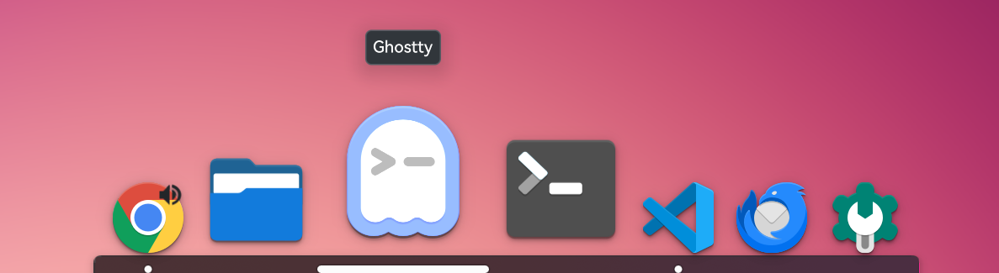

#  Latte Dock NG

> **Fork notice**: This is an unofficial fork of [KDE Latte Dock](https://github.com/KDE/latte-dock) maintained by Ruizhi Zhong, targeting **KDE Plasma 6.3+ on Wayland only**. Development happens on Plasma 6.5+ / Qt 6.11; Plasma 6.3 (Debian 13 trixie) is verified as the minimum supported version. X11 support has been intentionally removed.

Latte Dock NG is a Wayland-first dock for KDE Plasma 6.3+ that provides an elegant and intuitive experience for your tasks and widgets. It animates its contents using a parabolic zoom effect and stays out of the way when not needed.

**"Art in Coffee"**

Screenshots
===========

Classic dock style:



Modern dock style:


Development
============

- This fork: https://github.com/ruizhi-lab/latte-dock-ng
- Release notes: `CHANGELOG.md`
- Upstream KDE repo: https://invent.kde.org/plasma/latte-dock
- GitHub mirror of upstream: https://github.com/KDE/latte-dock
- Bug reports for this fork: https://github.com/ruizhi-lab/latte-dock-ng/issues
- Bug reports for upstream: https://bugs.kde.org/enter_bug.cgi?product=lattedock


Installation
============

### Requirements

We need to use at least:

- **Plasma >= 6.3.0** (developed and fully verified on Plasma 6.5+)
- **PlasmaWaylandProtocols >= 1.6.0**
- **Qt >= 6.6**
- **Wayland session (X11 is not supported in this fork)**

Minimum requirements:
 
**tools:**
```
 bash
 cmake >= 3.20 (C++20 capable compiler: GCC 10+ / Clang 12+)
 extra-cmake-modules
```

**development packages for:**
```
 Qt6Core >= 6.6.0
 Qt6Gui >= 6.6.0
 Qt6DBus >= 6.6.0
 Qt6Qml >= 6.6.0
 Qt6Quick >= 6.6.0
 Qt6Widgets >= 6.6.0
 Qt6WaylandClient >= 6.6.0

 Plasma >= 6.3.0
 PlasmaQuick >= 6.3.0
 PlasmaActivities >= 6.3.0
 KWayland >= 6.0.0
 LibTaskManager >= 6.3.0

 KF6CoreAddons >= 6.0.0
 KF6GuiAddons >= 6.0.0
 KF6DBusAddons >= 6.0.0
 KF6Declarative >= 6.0.0
 KF6Package >= 6.0.0
 KF6XmlGui >= 6.0.0
 KF6IconThemes >= 6.0.0
 KF6KIO >= 6.0.0
 KF6I18n >= 6.0.0
 KF6Notifications >= 6.0.0
 KF6NewStuff >= 6.0.0
 KF6Archive >= 6.0.0
 KF6GlobalAccel >= 6.0.0
 KF6Crash >= 6.0.0
 KF6WindowSystem >= 6.0.0

 PlasmaWaylandProtocols >= 1.6
 Wayland::Client
 LayerShellQt >= 6.0.0
```

### Binary packages (GitHub Releases)

Prebuilt packages are attached to every
[GitHub release](https://github.com/ruizhi-lab/latte-dock-ng/releases):

- **`.deb`** — two variants are provided, because libplasma's soname
  changed from 6 to 7 between Plasma 6.5 and 6.6 (Debian package
  `libplasma6` → `libplasma7`) and the two camps are binary-incompatible:
  - `latte-dock-ng_<ver>-1_amd64.deb` (plain name) — built on Debian sid,
    links `libplasma7`; for **Debian testing / sid and Ubuntu 26.04+**
  - `latte-dock-ng_<ver>-1+deb13u1_amd64.deb` — built on Debian 13
    (trixie), links `libplasma6`; the `+deb13u1` revision marks the
    Debian 13 (stable) build
- **`.rpm`** — built on Fedora 44; installable on any RPM distro shipping
  Plasma 6.3+ and glibc >= 2.34: Fedora 42+, openSUSE Tumbleweed/Leap 16,
  Mageia 10+
- **`pkg.tar.zst`** — Arch Linux

Every binary package format is install-checked automatically on its target
distro before release: source install, package-manager install
(apt / dnf / pacman) and a headless launch. The NixOS flake is also checked
and built as a release gate; Nix users consume it through the flake interface
instead of a standalone binary archive.

### Distribution channels

Release tags can be published through the supported package channels by the
`Publish distribution channels` workflow:

- **Arch Linux**: the `latte-dock-ng` AUR package.
- **Fedora**: the Latte Dock NG COPR project.
- **Debian**: the signed APT repository at
  `https://ruizhi-lab.github.io/latte-dock-ng/`, with `trixie` and `sid`
  suites.
- **Gentoo**: the personal
  [`ruizhi-overlay`](https://github.com/ruizhi-lab/gentoo-overlay).
- **NixOS**: this repository's flake package and default overlay.

The AUR, COPR, and APT publishers require repository-owner configuration; see
[`packaging/README.md`](packaging/README.md). A custom domain is not required
for the Debian repository.

The RPM requires glibc >= 2.34, a toolchain artifact
(`__libc_start_main@GLIBC_2.34` from the build host's crt1) present in every
modern build. It never blocks a Plasma 6.3+ distro — the oldest of them
(Mageia 10) ships glibc 2.38. openSUSE Leap 15.x is **not** supported: it
ships Plasma 5.27, which predates the Plasma 6.3 requirement.

### From my personal gentoo overlay for Gentoo Linux

```bash
eselect repository add ruizhi-overlay git https://github.com/ruizhi-lab/gentoo-overlay.git
emaint sync -r ruizhi-overlay
emerge -av kde-misc/latte-dock-ng
```

### NixOS

Add it as a flake input, then put its module in your `nixosSystem`'s
`modules` list:

```nix
# flake.nix
inputs.latte-dock-ng.url = "github:ruizhi-lab/latte-dock-ng";

# in your nixosSystem call
nixpkgs.lib.nixosSystem {
  system = "x86_64-linux";
  modules = [
    inputs.latte-dock-ng.nixosModules.default
    ./configuration.nix
  ];
};
```

That module just applies the package overlay. It doesn't install anything
on its own, but every other module in the list now sees `pkgs.latte-dock-ng`
with no further wiring, so add it wherever you list system packages:

```nix
# configuration.nix
{ pkgs, ... }: {
  environment.systemPackages = [ pkgs.latte-dock-ng ];
}
```

Or build/run it directly without adding it as an input:

```bash
nix build github:ruizhi-lab/latte-dock-ng
nix run github:ruizhi-lab/latte-dock-ng
```

See the [installation instructions](./INSTALLATION.md#nixos) for building from source instead.

### From source

```bash
git clone https://github.com/ruizhi-lab/latte-dock-ng.git
cd latte-dock-ng
mkdir build && cd build
cmake .. -DCMAKE_INSTALL_PREFIX=/usr
cmake --build . --parallel $(nproc)
sudo cmake --install .
```

See the [installation instructions](./INSTALLATION.md) for distro-specific dependency setup.

### Helper scripts

```bash
# Build + install (pre-clean enabled by default)
bash install.sh --help
bash install.sh
bash install.sh --clean --purge-user-data

# Uninstall (manifest + known root/user override paths)
bash uninstall.sh --help
bash uninstall.sh --dry-run
bash uninstall.sh --purge-user-data
```

## Run Latte Dock NG

Latte Dock NG is now ready to be used by executing
```
latte-dock-ng
```

or activating **Latte Dock NG** from the applications menu.


Contributors
============
- [Ruizhi Zhong](https://github.com/ruizhi-lab): Maintainer of this fork (Plasma 6.5+ / Wayland).
- [Varlesh](https://github.com/varlesh): Logos and Icons.
- Original Latte Dock authors and contributors: thank you for the upstream foundation.


License & Copyright
===================

**Current fork (Latte Dock NG):**
Copyright (C) 2024-2026 Ruizhi Zhong
Author & Contact: Ruizhi Zhong <ruizhi.zhong88@gmail.com>
Licensed under GNU General Public License 3.0 (GPL-3.0).

This project is based on the original Latte Dock by KDE contributors.
Special thanks to all original Latte Dock authors and contributors.

This program is free software: you can redistribute it and/or modify it under the terms of the GNU General Public License as published by the Free Software Foundation, either version 3 of the License, or (at your option) any later version.

This program is distributed in the hope that it will be useful, but WITHOUT ANY WARRANTY; without even the implied warranty of MERCHANTABILITY or FITNESS FOR A PARTICULAR PURPOSE. See the GNU General Public License for more details.

The full text of the GPL-3.0 license is available at: https://www.gnu.org/licenses/gpl-3.0.html
